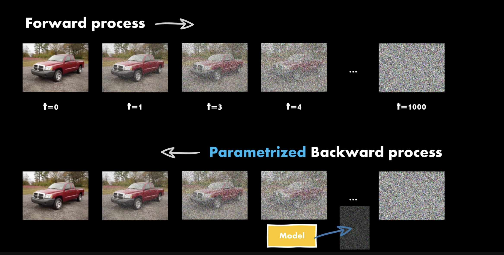

# Diffusion

While diffusion is popularily applied to images, it can be applied to any tokens. For the sake of intuitiveness, the following will describe diffusion in the context of images, but understand and be aware that it applies to any tokens

### Forward Process

Input  -> noise

### *Parametrized* Backward Process

noise -> Input

Also known as a Markov's chain, because each time step relies on the previous time step.

Diffusion essentially reverse engineers noise to images, given images to noise as training data.

*Credit to <a href="https://www.youtube.com/watch?v=a4Yfz2FxXiY&ab_channel=DeepFindr">DeepFindr</a> for the visuals!*