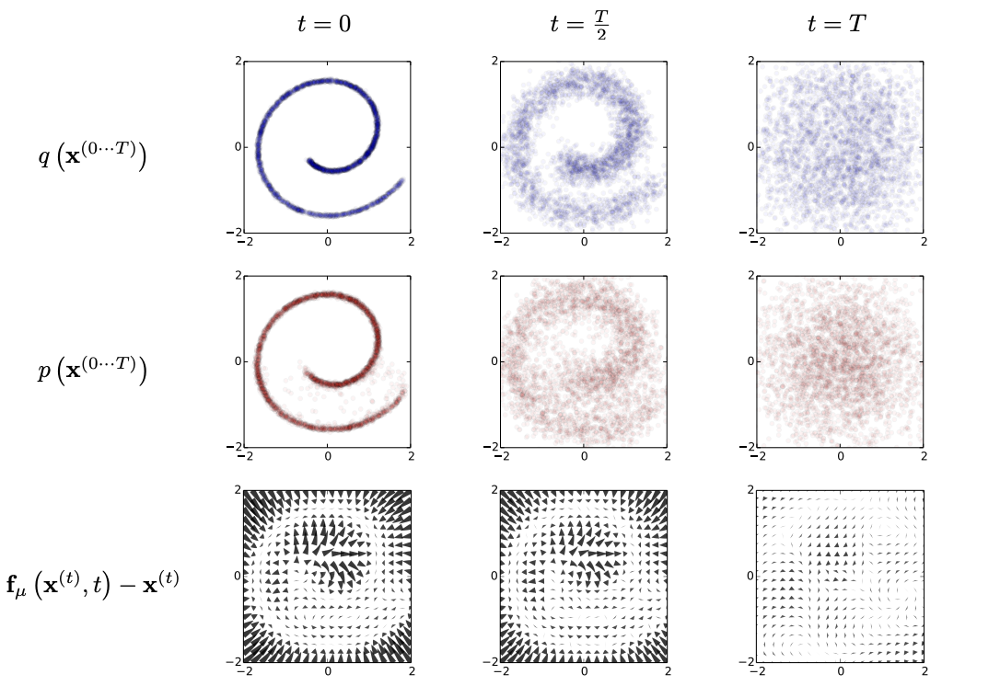
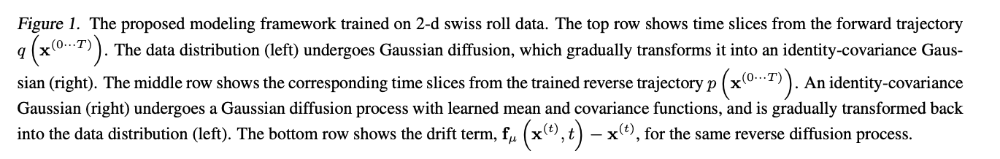

# Diffusion

While diffusion is popularily applied to images, it can be applied to any tokens. For the sake of intuitiveness, the following will describe diffusion in the context of images, but understand and be aware that it applies to any tokens

### Forward Process

Input  -> noise

The model takes an input image x0 and gradually adds Gaussian noise to it through a series of T steps.

### *Parametrized* Backward Process

noise -> Input

A neural network is trained to reccover the original data by reversing the noising process. 

  <a href="https://arxiv.org/pdf/1503.03585">Sohl-Dickstein et. al</a>

Also known as a Markov's chain, because each time step relies on the previous time step.

Diffusion essentially reverse engineers noise to images, given images to noise as training data.

*Credit to <a href="https://www.youtube.com/watch?v=a4Yfz2FxXiY&ab_channel=DeepFindr">DeepFindr</a> for the visuals!*