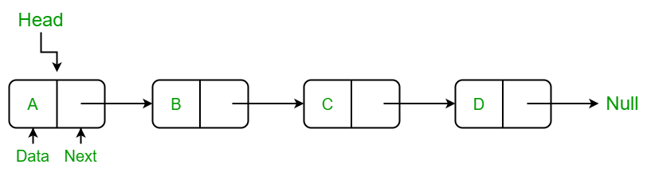

# Data Structures and Algorithms 

*In Python*

1.  [Stacks](#1-stacks)
1.  [Linked Lists](#2-linked-lists)

## 1. Stacks
Declared as an array. Conceptually: a vertical array.  
`myStack = []`

**LIFO**: **last** element IN, is the **first** element OUT

| Operation | Big-O Time |
|----------|----------|
| *stack*.**append()**  : add element                  | O(1)   | 
| *stack*.**pop()**   :  see & remove top element    | O(1)   |
| *stack* **[-1]**  : see top element                           | O(1)   |

 

 
 

**Practice problems** 
*solutions in `Arrays/stacks.py`*
- [Valid Parentheses](https://leetcode.com/problems/valid-parentheses/)
- [Min Stack](https://leetcode.com/problems/min-stack/description/)

## 2. Linked Lists

Linked lists are linear data structures where elements, called **nodes**, are connected sequentially, each containing a **value** and a **pointer** (or a reference) to the **next node** in the sequence.

| Operation                            | Big-O Time |
|---------------------------------------|------------|
| *node*.**val** : returns the value of the node | O(1)       |
| *node*.**next** : points pointer to the next node / "adds" a node to linked list | O(1)       |

*where ll is a pointer, pointing to a node in a linked list*

 

 
 

### 2.1 Singly Linked Lists

**Practice problems** 
*solutions in `Arrays/linked_lists.py`*
- [Reverse a Linked List](https://leetcode.com/problems/reverse-linked-list/description/)
