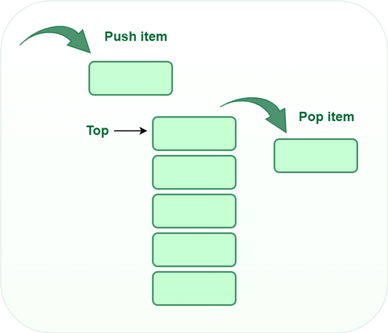

# Data Structures and Algorithms

1.  [Stacks](#1-stacks)

## 1. Stacks

`myStack = []`

| Operation | Big-O Time |
|----------|----------|
| Push          | O(1)   |
| Pop           | O(1)   |
| Peek / Top    | O(1)   |

