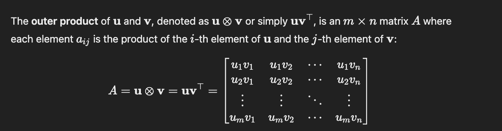

# ML Interview Questions & Answers

*Questions are from [Introduction to ML Interviews Book](https://huyenchip.com/ml-interviews-book/) by Chip Huyen.*

1. [Vectors](#11-vectors)

## 1.1 Vectors

### Important terminology
- **Span**: 
**All possible vectors** that can be made by combining the original vectors
  - ex. *span{[1,0] , [0,1]}* can create ANY *2D* vector by combining these

  **Span{v₁, v₂, …, vₙ} = {c₁v₁ + c₂v₂ + … + cₙvₙ | cᵢ ∈ ℝ}**

- **Subspace**: A **subset** of a vector space that still keeps the properties of the vector space. In other words,
  - If you take vectors v and w in the subspace:
    - Their **sum** (v+w) is **in the original subspace**
    - Any **scalar multiple** (cv or cw) **is in the original subspace**

- **Linearly independent**: Linear independent vectors are vectors that cannot be expressed as the linear combination of other vectors in its set
  - ex. let *v1 = [1, 0], v2 = [0, 1], v3 = [1, 1]*
    - v1 and v2 are linearly independent.  
    v3 is linearly *dependent* because it can be expressed as *v3 = 1 * v1 + 1 * v2*

- **Rank**: the number of linearly independent vectors in a matrix
  - ex. Take matrix A below

    |    |    |   |
    |----|----|----|
    | 1 |  0 |  1 |
    | 0 |  1 |  1 |
    | 0 |  0 |  0 |

    Here, columns 1 and 2 are independent (can't make one from the other. Column 3 is Column 1 + Column 2.  
  Therefore, rank(A) = 2

### 1. **Dot Product**

**i. [E] What’s the geometric interpretation of the dot product of two vectors?**

- The dot product represents the magnitude of one vector projected onto another, capturing the "shadow"/component of one vector in the direction of the other
- Mathematically, if `a` is the angle between vectors `A` and `B`, the dot product is given by:
  `A · B = |A| |B| cos(a)`
  where `|A|` and `|B|` are the magnitudes of vectors `A` and `B`, respectively

**ii. [E] Given a vector `u`, find a vector `v` of unit length such that the dot product of `u` and `v` is maximized.**

- The dot product is defined as `u · v = |u| |v| cos(θ)`, where `θ` is the angle between the vectors
- To maximize the dot product, `cos(θ)` should be maximized, which occurs when `θ = 0`. At this angle, `cos(0) = 1`
- Therefore, the maximum dot product is achieved when `v` is in the same direction as `u`, and its magnitude is 1
    - Isolating for `v`,  `v` is given by: `v = u / |u|` where `|u|` is the magnitude of vector `u`

### 2. **Outer Product**

Outer product ⊗ combines two vectors to produce a matrix. 

  

**i. [E] Given two vectors `a = [3, 2, 1]` and `b = [-1, 0, 1]`, calculate the outer product `aTb`.**

Matrix aTb:

|    |    |    |
|----|----|----|
| -3 |  0 |  3 |
| -2 |  0 |  2 |
| -1 |  0 |  1 |

**ii. [M] Give an example of how the outer product can be useful in ML.**

Take two vectors, 'weather': [temperature, humidity] & 'crop': [wheat, corn, rice].  
The outer product of 'weather' and 'crop' can capture all possible interactions between the two. In other words, the outer product shows how each weather feature influences each crop type.
  
'weather' T 'crop': 
|    |    |    |
|----|----|----|
| temperature • wheat |  temperature • corn |  temperature • rice |
| humidity • wheat |  humidity • corn |  humidity • rice |

 

**iii. [E] What does it mean for two vectors to be linearly independent?**

- Linearly independent vectors (in a set) are defined as vectors that cannot be expressed as linear combinations of the other vectors.
- For two vectors to be linearly independent means that neither is the scalar multiple of the other.
  - Given given vectors 'v' and 'w', they are linearly independent if and only if the equation `av + bw = 0` has only the trivial solution `a = b = 0`

**iv. [M] Given two sets of vectors `A = {a1, a2, a3, ..., an}` and `B = {b1, b2, b3, ..., bm}`, how do you check that they share the same basis?**

- A basis is a set of vectors that are:
  - Linearly independent (i.e. no vector can be made from combinations of the others)
  - Can generate/create all vectors in the space (span)
  - Think of it like a coordinate system; you need just enough vectors to reach any point, but no extra/redundant ones (i.e. linearly dependent vectors)

**v. [M] Given `n` vectors, each of `d` dimensions, what is the dimension of their span?**

- The span of a set of vectors is the collection of all possible linear combinations of those vectors. The maximum number of linearly independent vectors in *d*-dimensional space is *d*. If you have *n* vectors in *d*-dimensional space, the dimension of their span is equal to the number of lineqrly independent vectors in the set. 
- Therefore, the answer is min(*n*, *d*).
  - To find the exact dimension of the span, form a matrix with the vectors as columns & perform **row reduction** to determine the rank of the matrix (i.e. the number of linearly independent vectors)

- Take *n* x *m* matrix A (*n* rows and *m* columns). Assume all vectors in matrix A are linearly independent.
  - If n < m:
    - There are more vectors (m) than the dimensionality of the space (n)
    - Therefore, the dimension of the span is n, as there are enough vectors to span an n-dimension space

    
    |    |    |    |
    |----|----|----|
    | n₁m₁ |  n₁m₂ | n₁m₃  |
    | n₂m₁  |n₂m₂   | n₂m₃  |

  - If n > m:
    - There are fewer vectors (m) than the dimensionality of the space (n)
    - The vectors are limited to spanning an m-dimension subspace within the n-dimensional space, meaning the dimension of the span is m

    |    |    |
    |----|----|
    | n₁m₁ |  n₁m₂ 
    | n₂m₁  |n₂m₂   |
    | n₁m₃ | n₁m₂  |
  

### 3. **Norms and Metrics**

**i. [E] What's a norm? What is `L0, L1, L2, Lnorm`?**

- **Norm**: the "size" or "length" of vectors
  
- **L0**: the number of non-zero values in the vector
  - ex. v = [1, 0, 3]. ||v||₀ = 2
- **L1**: the sum of the absolute values of all numbers in the vector
  - ex. v = [1, -2, 3]. ||v||₁ = |1| + |-2| + |3| = 1 + 2 + 3 = 6
- **L2**: calculates the "straight-line" distance from thhe origin to the point represented by the vector (euclidiean norm). Classical distance equation. 
    *||v||₂ = (|v₁|^2 + |v₂|^2)^(1/2)*  or
    *||v||₂ = sqrt(|v₁|^2 + |v₂|^2)*

  - ex. v = [3, 4]. ||v||₂ = sqrt(3^2 + 4^2) = 5

 

- **Lnorm**: generalizes L1 and L2 norms by allowing any power p where p >= 1.  
    - **General equation:
   
  ||v||ₚ = (|v₁|^p + |v₂|^p + ⋯ + |vₙ|^p)^(1/p) or 
   
  ||v||ₚ = sqrt((v₁)^2 + ... + (vₙ)^2)**

 

**ii. [M] How do norm and metric differ? Given a norm, make a metric. Given a metric, can we make a norm?**

- **Metric**: Measures the distance between elements in a set. It allows us to quantify how "far apart" two elements are within that set

- **Norm vs. Metric:** Norms are defined on a **vector space**, while metrics are defined on any **set** (it measures the "distance" between elements, which need not be vectors)

- **Norm to Metric**: Define d(u, v) = ||u-v||, where u & v are vectors.
  - An intuitive example:
     
    Norm (distance from city center):

      ||A|| = 5 miles (Restaurant A is 5 miles from city center)  
      ||B|| = 3 miles (Restaurant B is 3 miles from city center)

      Metric (distance between restaurants):

      d(A,B) = ||A - B|| = distance between restaurants.  
      If you want to know the distance between two places, you can:

      Start at A  
      Follow how to get to city center (subtract A)  
      Follow path to B (add B)  
      The total path = ||B - A|| = distance between restaurants!

      So metric naturally comes from norm like:
      "To find the distance between places, see how their positions differ from downtown". Intuitively, 
      **You often navigate by knowing locations relative to a central point.
      The difference in these relative positions tells you how far apart things are**

- **Metric to Norm**: Not always possible. Only metrics compatible with vector space operations (like translation and scaling) can be derived from a norm
  - From the intuitive example above: Just because we know how far apart restaurants are (metric), we can't always figure out how far each is from downtown (norm)!