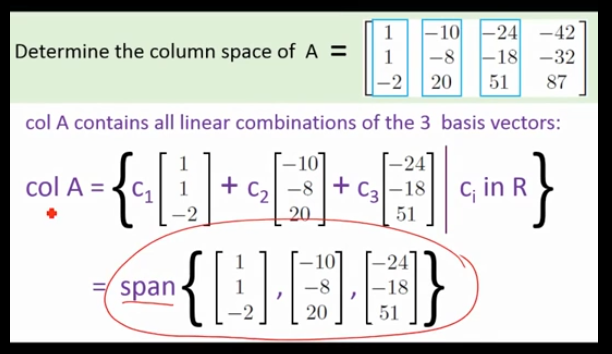

# ML Interview Questions & Answers

Linear Algebra, Statistics & Probability from scratch.

*Includes all answers to the questions from [Introduction to ML Interviews Book](https://huyenchip.com/ml-interviews-book/) by Chip Huyen.*

1.  [Vectors](#1-vectors)
2.  [Matrices](#2-matrices)
10. [Probability](#10-probability)

## 1. Vectors

### Important terminology
- **Span**: 
**All possible vectors** that can be made by combining the original vectors
  - ex. *span{[1,0] , [0,1]}* can create ANY *2D* vector by combining these

  **Span{v₁, v₂, …, vₙ} = {a₁v₁ + b₂v₂ + … + cₙvₙ | a,b, ..., c ∈ ℝ}**

- **Subspace**: A **subset** of a vector space that still keeps the properties of the vector space. In other words,
  - If you take vectors v and w in the subspace:
    - Their **sum** (v+w) is **in the original subspace**
    - Any **scalar multiple** (cv or cw) **is in the original subspace**

- **Linearly independent**: Linear independent vectors are vectors that cannot be expressed as the linear combination of other vectors in its set
  - ex. let *v1 = [1, 0], v2 = [0, 1], v3 = [1, 1]*
    - v1 and v2 are linearly independent.  
    v3 is linearly *dependent* because it can be expressed as *v3 = 1 * v1 + 1 * v2*
  - If you removed linearly independent vectors from a set, the span of the set WILL change

- **Linearly dependent**: Vectors that can be expressed as the linear combination of other vectors in its set
  - If you removed linearly dependent vectors from a set, the span of the set would NOT change

- **Basis**:
  - A set of **linearly independent** vectors that **span** the full space
  - Think of it like a coordinate system; you need just enough vectors to reach any point. No extra/redundant ones (i.e. linearly dependent vectors)

- **Rank**: the number of linearly independent vectors in a matrix.   Ie. **Rank = dimension of span**, 
  - ex. Take matrix A below

    |    |    |   |
    |----|----|----|
    | 1 |  0 |  1 |
    | 0 |  1 |  1 |
    | 0 |  0 |  0 |

    Here, columns 1 and 2 are independent (can't make one from the other. Column 3 is Column 1 + Column 2.  
  Therefore, rank(A) = 2

- **Basis**: Unit vectors (î, ĵ, ... ) of the coordinate system

### 1. **Dot Product**

**i. [E] What’s the geometric interpretation of the dot product of two vectors?**

- The dot product represents the magnitude of one vector projected onto another, capturing the "shadow"/component of one vector in the direction of the other
- Mathematically, if `a` is the angle between vectors `A` and `B`, the dot product is given by:
  `A · B = |A| |B| cos(a)`
  where `|A|` and `|B|` are the magnitudes of vectors `A` and `B`, respectively

**ii. [E] Given a vector `u`, find a vector `v` of unit length such that the dot product of `u` and `v` is maximized.**

- The dot product is defined as `u · v = |u| |v| cos(θ)`, where `θ` is the angle between the vectors
- To maximize the dot product, `cos(θ)` should be maximized, which occurs when `θ = 0`. At this angle, `cos(0) = 1`
- Therefore, the maximum dot product is achieved when `v` is in the same direction as `u`, and its magnitude is 1
    - Isolating for `v`,  `v` is given by: `v = u / |u|` where `|u|` is the magnitude of vector `u`

### 2. **Outer Product**

Outer product ⊗ combines two vectors to produce a matrix. 

  

**i. [E] Given two vectors `a = [3, 2, 1]` and `b = [-1, 0, 1]`, calculate the outer product `aTb`.**

Matrix aTb:

|    |    |    |
|----|----|----|
| -3 |  0 |  3 |
| -2 |  0 |  2 |
| -1 |  0 |  1 |

**ii. [M] Give an example of how the outer product can be useful in ML.**

Take two vectors, 'weather': [temperature, humidity] & 'crop': [wheat, corn, rice].  
The outer product of 'weather' and 'crop' can capture all possible interactions between the two. In other words, the outer product shows how each weather feature influences each crop type.
  
'weather' T 'crop': 
|    |    |    |
|----|----|----|
| temperature • wheat |  temperature • corn |  temperature • rice |
| humidity • wheat |  humidity • corn |  humidity • rice |

 

**iii. [E] What does it mean for two vectors to be linearly independent?**

- Linearly independent vectors (in a set) are defined as vectors that cannot be expressed as linear combinations of the other vectors.
- For two vectors to be linearly independent means that neither is the scalar multiple of the other.
  - Given given vectors 'v' and 'w', they are linearly independent if and only if the equation `av + bw = 0` has only the trivial solution `a = b = 0`

**iv. [M] Given two sets of vectors `A = {a1, a2, a3, ..., an}` and `B = {b1, b2, b3, ..., bm}`, how do you check that they share the same basis?**

**v. [M] Given `n` vectors, each of `d` dimensions, what is the dimension of their span?**

- The span of a set of vectors is the collection of all possible linear combinations of those vectors. The maximum number of linearly independent vectors in *d*-dimensional space is *d*. If you have *n* vectors in *d*-dimensional space, the dimension of their span is equal to the number of lineqrly independent vectors in the set. 
- Therefore, the answer is min(*n*, *d*).
  - To find the exact dimension of the span, form a matrix with the vectors as columns & perform **row reduction** to determine the rank of the matrix (i.e. the number of linearly independent vectors)

- Take *n* x *m* matrix A (*n* rows and *m* columns). Assume all vectors in matrix A are linearly independent.
  - If n < m:
    - There are more vectors (m) than the dimensionality of the space (n)
    - Therefore, the dimension of the span is n, as there are enough vectors to span an n-dimension space

    
    |    |    |    |
    |----|----|----|
    | n₁m₁ |  n₁m₂ | n₁m₃  |
    | n₂m₁  |n₂m₂   | n₂m₃  |

  - If n > m:
    - There are fewer vectors (m) than the dimensionality of the space (n)
    - The vectors are limited to spanning an m-dimension subspace within the n-dimensional space, meaning the dimension of the span is m

    |    |    |
    |----|----|
    | n₁m₁ |  n₁m₂ 
    | n₂m₁  |n₂m₂   |
    | n₁m₃ | n₁m₂  |
  

### 3. **Norms and Metrics**

**i. [E] What's a norm? What is `L0, L1, L2, Lnorm`?**

- **Norm**: the "size" or "length" of vectors
  
- **L0**: the number of non-zero values in the vector
  - ex. v = [1, 0, 3]. ||v||₀ = 2
- **L1**: the sum of the absolute values of all numbers in the vector
  - ex. v = [1, -2, 3]. ||v||₁ = |1| + |-2| + |3| = 1 + 2 + 3 = 6
- **L2**: calculates the "straight-line" distance from thhe origin to the point represented by the vector (euclidiean norm). Classical distance equation. 
    *||v||₂ = (|v₁|^2 + |v₂|^2)^(1/2)*  or
    *||v||₂ = sqrt(|v₁|^2 + |v₂|^2)*

  - ex. v = [3, 4]. ||v||₂ = sqrt(3^2 + 4^2) = 5

 

- **Lnorm**: generalizes L1 and L2 norms by allowing any power p where p >= 1.  
    - **General equation:
   
  ||v||ₚ = (|v₁|^p + |v₂|^p + ⋯ + |vₙ|^p)^(1/p) or 
   
  ||v||ₚ = sqrt((v₁)^2 + ... + (vₙ)^2)**

 

**ii. [M] How do norm and metric differ? Given a norm, make a metric. Given a metric, can we make a norm?**

- **Metric**: Measures the distance between elements in a set. It allows us to quantify how "far apart" two elements are within that set

- **Norm vs. Metric:** Norms are defined on a **vector space**, while metrics are defined on any **set** (it measures the "distance" between elements, which need not be vectors)

- **Norm to Metric**: Define d(u, v) = ||u-v||, where u & v are vectors.
  - An intuitive example:
     
    Norm (distance from city center):

      ||A|| = 5 miles (Restaurant A is 5 miles from city center)  
      ||B|| = 3 miles (Restaurant B is 3 miles from city center)

      Metric (distance between restaurants):

      d(A,B) = ||A - B|| = distance between restaurants.  
      If you want to know the distance between two places, you can:

      Start at A  
      Follow how to get to city center (subtract A)  
      Follow path to B (add B)  
      The total path = ||B - A|| = distance between restaurants!

      So metric naturally comes from norm like:
      "To find the distance between places, see how their positions differ from downtown". Intuitively, 
      **You often navigate by knowing locations relative to a central point.
      The difference in these relative positions tells you how far apart things are**

- **Metric to Norm**: Not always possible. Only metrics compatible with vector space operations (like translation and scaling) can be derived from a norm
  - From the intuitive example above: Just because we know how far apart restaurants are (metric), we can't always figure out how far each is from downtown (norm)!

## 2. Matrices

### Important terminology

- **Ax = v** 
    *where A is a matrix, x & v are vectors*
    Matrix A represents a linear transformation, of which vector x turns into vector v.

- **Identity Matrix**: the transformation that does **nothing**.   Leaves î, ĵ unmoved.
     ex. the identity matrix in 2D:
    |    |    |
    |----|----|   
    | 1 |  0 |
    | 0 |  1 |

- **Determinant**: A scalar that represents the factor by which a linear transformation scales area (in 2D) or volumes (in 3D) in the corresponding space.

  - The determinant is only defined for **square** matrices (n x n matrices)
    - ex. a 2x2 matrix scales area in a 2D plane, a 3x3 matrix scales volume in 3D space

  - The determinant of matrix A below:
    |    |    |
    |----|----|   
    | a |  b |
    | c |  d |

  
    = ad - bc

  - det(𝑀1 𝑀2) = det(𝑀1)det(𝑀2)
    - Applying the linear transformations 𝑀2 and 𝑀1 sequentially scales the area/volume by the product of their individual scaling factors (determinants), which is equivalent to the scalar botained by first applying the combined transformation 𝑀1𝑀2 (transformation 𝑀2 is applied first, followed by 𝑀1) and then determining how it scales the area/volume
  

- **Inverse A⁻¹** : The **reverse** transformation of matrix A.  

  - if det(A) != 0:
    - Can solve a system of linear equations/matrix with 
     `(A)(A⁻¹)x = (v)(A⁻¹)`
     `x = (v)(A⁻¹)`
     ie. playing the transformation matrix A in reverse and following vector v

    - `(A⁻¹)(A) = identity matrix`

    - ex. 
      - if A is a clockwise rotation of 90 degrees, A⁻¹ is a counterclockwise rotation of 90 degrees.
      - if A is a rightward shear that pushes ĵ one unit to the right, A⁻¹ is a leftward shear that pushes ĵ one unit to the left.

  - if det(A) = 0:
    - There is no inverse. 
      Cannot "undo" the transformation of a higher dimension into a lower dimension. 
      - ex. plane → line, 3D space → plane, 3D → line, 3D → point, etc
    

- **Column space/Range/Image**: Set of all possible **outputs** Av
   Columns of matrix tell you where basis vectors î, ĵ land (in the transformed space after transformation A) 
  
    

  

  

  

   

- **Kernel/null space**: Span of all volumns of matrix A
  Ie. set of all linear combinations of the columns of A

Therefo

**1. [E] Why do we say that matrices are linear transformations?**

**2. [E] What’s the inverse of a matrix? Do all matrices have an inverse? Is the inverse of a matrix always unique?**

**3. [E] What does the determinant of a matrix represent?**

**4. [E] What happens to the determinant of a matrix if we multiply one of its rows by a scalar t × R?**

**5. [M] A 4 × 4 matrix has four eigenvalues 3, 3, 2, -1. What can we say about the trace and the determinant of this matrix?**

**6. [M] Given the following matrix:**

  |    |    |    |
  |----|----|----|
  | 1  |  4 | -2 |
  | -1 |  3 |  2 |
  | 3  |  5 | -6 |

**Without explicitly using the equation for calculating determinants, what can we say about this matrix’s determinant?**

**Hint: rely on a property of this matrix to determine its determinant.**

**7. [M] What’s the difference between the covariance matrix `AᵀA` (A transpose multiplied by A) and the Gram matrix `AAᵀ` (A multiplied by A transpose)?**

**8. Given a matrix `A` (dimensions `n × m`) and a vector `b` (dimensions `n × 1`):**

**i. [M] Find `x` such that `Ax = b` (solve the linear equation)**  

**ii. [E] When does this have a unique solution?**
  
**iii. [M] Why is it when `A` has more columns than rows, `Ax = b` has multiple solutions?**
  
**iv. [M] Given a matrix `A` with no inverse, how would you solve the equation `Ax = b`? What is the pseudoinverse, and how do you calculate it?**
    

**9. Derivative is the backbone of gradient descent**.

**i. [E] What does the derivative represent?**

**ii. [M] What’s the difference between the derivative, gradient, and Jacobian?**
    
**10. [H] Say we have the weights `w` (dimensions `d × m`) and a mini-batch `x` of `n` elements, each element having shape `1 × d`, so `x` is of size `n × d`. We have the output `y = f(x; w) = xw`. What is the dimension of the Jacobian `∂y/∂x`?**
    
**11. [H] Given a very large symmetric matrix `A` that doesn’t fit in memory (say `A ∈ R^{1M × 1M}`) and a function `f` that can quickly compute `f(x) = Ax` for `x ∈ R^{1M}`, find the unit vector `x` such that `xᵀAx` is minimal.**

**Hint: Can you frame it as an optimization problem and use gradient descent to find an approximate solution?**

# 10. Probability

### Important Terminology

- **Mean** μ: 

  The mean of a distribution is the center of mass for that distribution. 
   Ie. what you would expect the **average outcome** to be if you repeated an experiment many times 
    E(X)=∑xP(x) 

- **Standard deviation** σ:

  Measures how dispered the data is in relation to the mean.

  

 

- **Common distributions**: 

  **Explain all the common distributions and write out its equation, draw its probability mass function (PMF) if it’s discrete and the probability density function (PDF) if it’s continuous.**

    1. Normal distribution
    2. 

- **Cross entropy**:
- **KL divergence**:
- **Probability distribution**:
