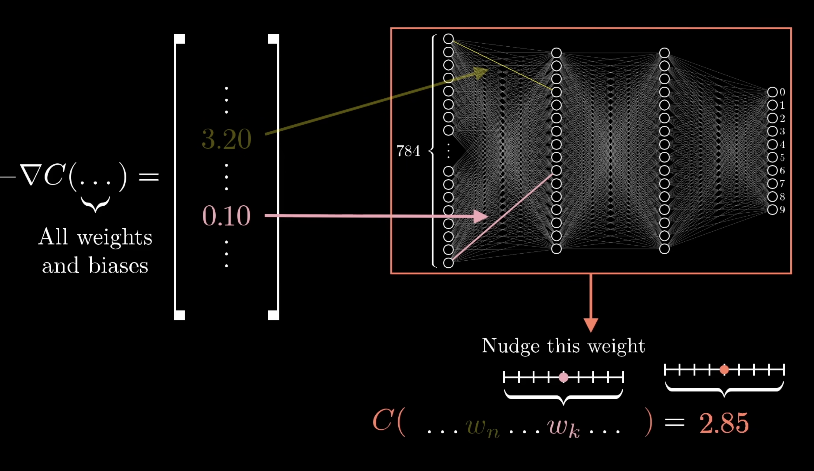

# ML from Scratch

This repository contains implementations of machine learning algorithms and data structures/algorithms from scratch.

- **Machine Learning**: Implementations of ML algorithms without external libraries (using only numpy)
- **Data Structures & Algorithms**: Fundamental data structures and algorithms, with additional practice questions

# 1. Neural Networks from Scratch

In the context of artificial neural networks:
- A neuron is a simple unit that holds a number.
- This number is called its "activation".

### What is a Neural Network?

- A neural network is made up of many neurons organized into layers.
- There are typically three types of layers:
  1. Input layer
  2. Hidden layer(s)
  3. Output layer


### What Does a Neural Network Do?

An artificial neural network is a statistical model that:
1. Learns patterns from training data
2. Applies these learned patterns to new, unseen data

## How Neural Networks Work

Now that we know what a neural network is, let's dive into how it operates.

### Connections Between Neurons

- Each neuron in one layer is connected to all neurons in the next layer.
- The strength of each connection is called its `"weight"`.
- During training, these weights are adjusted to identify patterns in the data.

### How a Neuron's Activation is Determined

The activation of a neuron is calculated based on:
1. The activations of all neurons in the **previous** layer
2. The weights of the connections to those neurons

Here's how it works:
1. Multiply each incoming activation by its corresponding weight
2. Sum up all these products
3. Add a special value called the `"bias"`

This can be represented by the formula:

```python
weighted_sum = w1*a1 + w2*a2 + ... + wn*an + bias
```

Where:
- `wi` is the weight of the connection from neuron `i` in the previous layer
- `ai` is the activation of neuron `i` in the previous layer
- bias is an extra adjustable value


### The Role of Bias

The bias serves an important function:
- It shifts the activation function
- This allows the neuron to adjust its sensitivity to inputs
- A positive bias makes the neuron more likely to activate
- A negative bias makes it less likely to activate


### Activation Functions

After calculating the weighted sum, we apply an "activation function". Common choices include:

1. Sigmoid function: Maps the output to a range between 0 and 1
2. ReLU (Rectified Linear Unit): Outputs the input if it's positive, otherwise outputs 0

In this guide, we'll focus on ReLU:

```python
def relu(self, x):
        return np.maximum(0, x)
```
ReLU is popular because it helps the network learn more effectively.

## Training the Neural Network

Now that we understand the basic structure and operation of a neural network, let's look at how it learns.

### Forward Propagation

This is the process of passing input through the network to get an output:

1. Start with the input layer
2. For each subsequent layer:
   a. Calculate the weighted sum for each neuron
   b. Apply the activation function
3. Repeat until we reach the output layer

### Measuring Performance: The Loss Function

To train our network, we need to measure how well it's doing. We do this with a loss function:

1. Compare the network's output to the desired output
2. Calculate the difference
3. Square this difference (to make all values positive)
4. Sum these squared differences for all output neurons

The result is called the "loss". **The smaller the loss, the better the network is performing.**

```python
def mse_loss(self, y, activations):    
        return np.mean((activations-y)**2)
```

### Gradient Descent and Backpropagation

To improve the network's performance, we need to adjust its weights and biases. We do this using two key concepts:

1. Gradient Descent: A method for minimizing the loss
2. Backpropagation: An algorithm for calculating how to adjust each weight and bias

Here's how it works:

1. Calculate the gradient of the loss function
   - This tells us how changing each weight and bias affects the loss
2. Update weights and biases in the direction that reduces the loss
3. Repeat this process many times




## Putting It All Together

Training a neural network involves repeating these steps many times:

1. Forward propagation: Pass input through the network
2. Calculate the loss: Measure how far off the output is
3. Backpropagation: Calculate how to adjust weights and biases
4. Update weights and biases: Make small adjustments to improve performance

After many iterations, the network learns to recognize patterns in the training data and can apply this knowledge to new, unseen data.

## A Simple Python Implementation

Here's a basic implementation of a neural network (feed-forward, multilayer percepton) from scratch in Python:

```python
import numpy as np

class Neuron:
    def __init__(self, num_inputs):
        self.weights = np.random.randn(num_inputs, 1) * 0.01
        self.bias = np.zeros((1, 1))

    def relu(self, x):
        return np.maximum(0, x)

    def forward(self, inputs):
        self.last_input = inputs
        weighted_sum = np.dot(inputs, self.weights) + self.bias
        self.last_output = self.relu(weighted_sum)
        return self.last_output

class Layer:
    def __init__(self, num_neurons, num_inputs_per_neuron):
        self.neurons = [Neuron(num_inputs_per_neuron) for _ in range(num_neurons)]

    def forward(self, inputs):
        return np.array([neuron.forward(inputs) for neuron in self.neurons]).T

class NeuralNetwork:
    def __init__(self, layer_sizes):
        self.layers = []
        for i in range(len(layer_sizes) - 1):
            self.layers.append(Layer(layer_sizes[i+1], layer_sizes[i]))

    def forward(self, inputs):
        for layer in self.layers:
            inputs = layer.forward(inputs)
        return inputs

    def mse_loss(self, y, activations):    
        return np.mean((activations-y)**2)

    def train(self, X, y, learning_rate, epochs):
        # Training code here (backpropagation)
        pass
```
To make it fully functional, you would need to implement the backpropagation algorithm in the `train` method.

## Congrats!
You've just taken your first steps into the world of neural networks. While there's much more to learn, you now have a solid foundation to build upon. Remember, the key to mastering neural networks is practice and experimentation. Happy learning!
